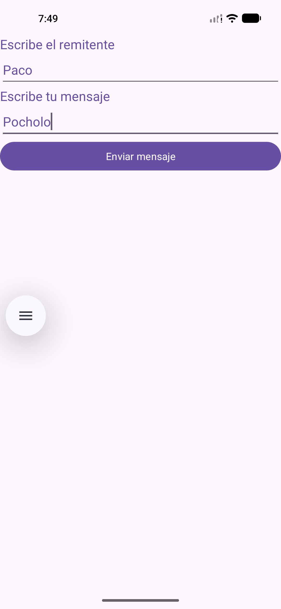
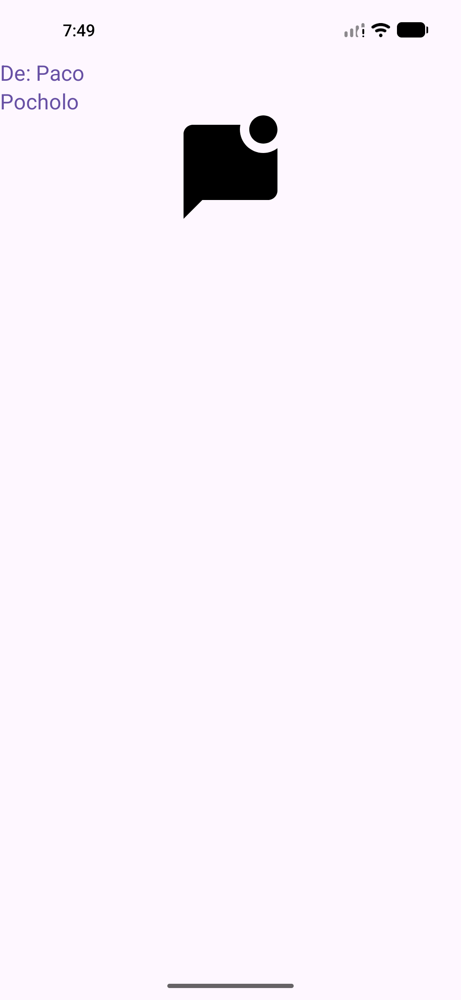
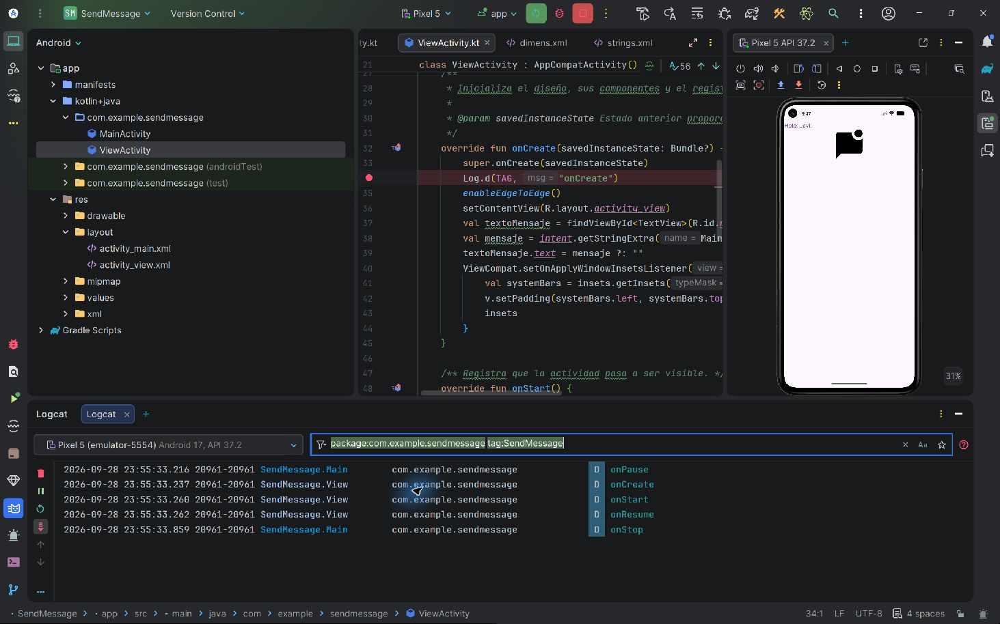
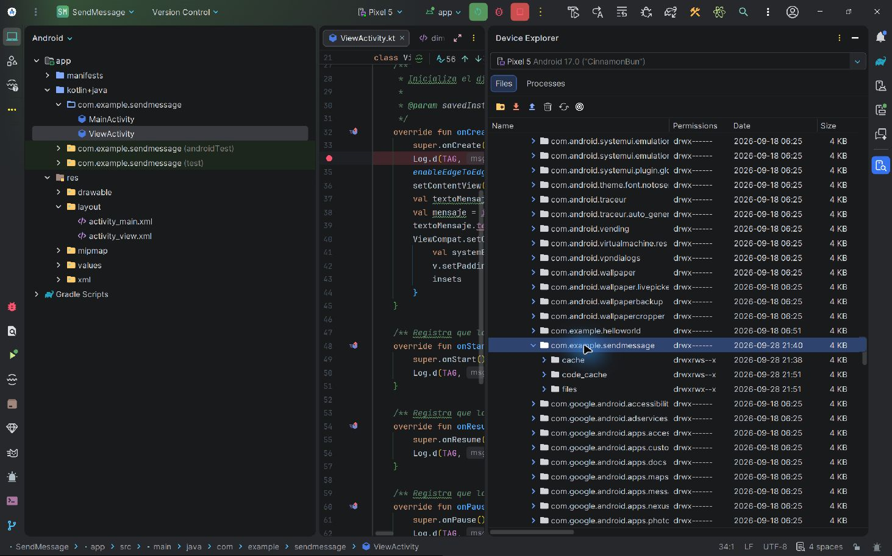

# SendMessage — aplicación Android con Kotlin y XML

Ejercicio de la Unidad 2: una aplicación Android con dos pantallas. El usuario escribe un remitente y un mensaje en la primera, y ve ambos en la segunda junto a un icono vectorial.

El nombre «enviar» se refiere al paso de datos entre pantallas de esta aplicación. No se envían SMS ni mensajes por Internet y no se mantiene un historial.

## Descripción

Proyecto educativo para practicar la comunicación entre actividades Android, los modelos de datos serializables y el registro del ciclo de vida. La lógica está en Kotlin y la interfaz utiliza vistas XML.

## Aplicación en ejecución

Capturas reales del emulador Pixel, tomadas el 6 de octubre de 2026. Muestran el envío de un mensaje junto con su remitente y la recepción de ambos en la segunda pantalla.

### Escribir el mensaje



### Ver el mensaje recibido



## Características

- Formulario para escribir el nombre del remitente y el texto del mensaje.
- Apertura de la segunda pantalla al pulsar **Enviar mensaje**.
- Envío de un objeto `Message` que contiene el texto y una `Person` remitente.
- Presentación del remitente con el formato `De: nombre`, del mensaje y de un icono vectorial decorativo.
- Posibilidad de volver a la primera pantalla para realizar otro envío.
- Registro de los métodos del ciclo de vida de cada actividad en Logcat.
- Prueba unitaria de serialización y pruebas de interfaz con Espresso.
- Documentación KDoc y generación de HTML con Dokka.

## Arquitectura y tecnologías

La aplicación tiene un único módulo Android, `app`, con dos actividades y un paquete `model`. Las actividades gestionan directamente los controles mediante `findViewById`; no se ha implementado MVVM, MVI ni Clean Architecture. La interfaz no utiliza Jetpack Compose.

El flujo es: `MainActivity` recoge los campos, crea un `Message` con su `Person`, lo adjunta a un Intent explícito y abre `ViewActivity`. Esta recupera el objeto mediante la clave compartida `MainActivity.EXTRA_MESSAGE` y muestra sus propiedades.

| Componente | Tecnología o configuración |
| --- | --- |
| Lenguaje | Kotlin 2.2.10, integrado en Android Gradle Plugin. |
| Interfaz | XML, `LinearLayout`, Android Views y tema Material Components. |
| Actividades | AndroidX AppCompat y Activity KTX. |
| Utilidades Android | AndroidX Core KTX para las barras del sistema. |
| Paso de datos | Intent explícito y `java.io.Serializable`. |
| Parcelize | Plugin activado; los modelos todavía no usan `@Parcelize` ni `Parcelable`. |
| Compilación | Android Gradle Plugin 9.2.1 y Gradle Wrapper 9.4.1. |
| Versiones Android | `minSdk` 24, `targetSdk` 36 y `compileSdk` 37.1. |
| Pruebas | JUnit 4, AndroidX Test y Espresso. |
| Documentación | KDoc y Dokka 2.2.0. |
| Publicación de documentación | GitHub Actions y GitHub Pages. |

ConstraintLayout está declarado como dependencia, pero los diseños actuales son `LinearLayout`. No se utilizan Room, Retrofit, Hilt ni servicios externos.

## Comenzando

### Requisitos

- Android Studio con soporte para Android Gradle Plugin 9.2.1. No se fija una versión concreta del IDE en el repositorio.
- JDK 21 para el daemon de Gradle, conforme a `gradle/gradle-daemon-jvm.properties`. La compatibilidad del código Java del módulo está configurada a Java 11; son ajustes diferentes.
- Android SDK con la plataforma correspondiente a `compileSdk` 37.1.
- Un emulador o dispositivo Android API 24 o superior para ejecutar la aplicación y las pruebas de interfaz.
- Acceso a Internet para descargar las dependencias al configurar el proyecto. La aplicación no necesita conexión para enviar los datos entre sus pantallas.

### Instalación y ejecución

1. Clona el repositorio o descarga sus archivos:

   ```powershell
   git clone https://github.com/aljavieragradanokrasimirova-svg/SendMessage.git
   cd SendMessage
   ```

2. Abre la carpeta `SendMessage` en Android Studio y deja que Gradle sincronice. Instala los componentes del SDK que solicite el IDE.
3. Comprueba la configuración de Java y el SDK en tu equipo. `local.properties` contiene una ruta local y no se comparte en Git.
4. Inicia un emulador o conecta un dispositivo con depuración USB.
5. Selecciona la configuración `app` y pulsa **Run**.
6. Introduce un remitente y un mensaje, pulsa **Enviar mensaje** y comprueba que aparecen en la segunda pantalla.

También puedes compilar desde PowerShell, en la raíz del proyecto:

```powershell
.\gradlew.bat :app:assembleDebug
```

El APK debug se genera en `app/build/outputs/apk/debug/app-debug.apk`. Si el terminal no encuentra Java, configura `JAVA_HOME` con la ruta de tu JDK; en este equipo se ha utilizado temporalmente:

```powershell
$env:JAVA_HOME = "C:\Program Files\Android\Android Studio\jbr"
```

No es necesario instalar Gradle por separado: se utiliza el wrapper incluido en el repositorio.

## Módulos y estructura del proyecto

El único módulo de compilación es `app`. No hay API REST, endpoints, servidor ni base de datos: la comunicación ocurre dentro de la misma aplicación.

| Archivo o carpeta | Función |
| --- | --- |
| `app/src/main/java/com/example/sendmessage/MainActivity.kt` | Recoge remitente y texto y envía el objeto Message mediante un Intent explícito. |
| `app/src/main/java/com/example/sendmessage/ViewActivity.kt` | Recupera el objeto y muestra remitente y texto. |
| `app/src/main/java/com/example/sendmessage/model/` | Clases serializables Person y Message. |
| `app/src/main/res/layout/activity_main.xml` | Campos para remitente y mensaje, más el botón de envío. |
| `app/src/main/res/layout/activity_view.xml` | Remitente, texto recibido e imagen. |
| `app/src/main/res/values/` | Cadenas, colores, dimensiones, estilos y temas. |
| `app/src/main/res/drawable/` | Recursos gráficos; incluye el vector de chat usado dentro de la app. |
| `app/src/main/res/mipmap-*/` | Iconos de lanzamiento para distintas densidades. |
| `app/src/main/AndroidManifest.xml` | Declara las actividades y la pantalla de inicio. |
| `app/src/test/` | Pruebas unitarias locales, incluida la serialización de Message y Person. |
| `app/src/androidTest/` | Pruebas de interfaz que requieren un emulador o dispositivo. |
| `gradle/libs.versions.toml` | Catálogo de versiones y dependencias. |
| `Screenshots/` | Capturas actuales del formulario y del mensaje recibido. |
| `documentacion/imagenes/` | Evidencias de Logcat y del directorio de la aplicación. |
| `.opencode/skills/` | Skills proporcionadas por la profesora para documentación y licencia; no forman parte de la aplicación Android. |

## Decisiones de diseño

- La interfaz está declarada en XML y la lógica está escrita en Kotlin, para mantenerlas separadas.
- Las dos pantallas utilizan un `LinearLayout` vertical. Sus elementos aparecen uno debajo de otro, en el orden del XML.
- Se conserva el nombre `MainActivity` creado en el proyecto; cumple el papel de la pantalla de envío denominada SendActivity en el enunciado. La segunda se llama `ViewActivity`.
- `findViewById` localiza los campos `senderName` y `userMessage` y el botón `sendMsgButton`.
- Los textos se leen dentro del `setOnClickListener`, cuando el usuario pulsa el botón. Se crea un `Message` que contiene el texto y una `Person` remitente. Ambas clases implementan `Serializable`.
- Un Intent explícito indica la actividad de destino; `putExtra` adjunta el objeto y `startActivity` abre la pantalla. La clave compartida `MainActivity.EXTRA_MESSAGE` permite recuperarlo con `getSerializableExtra`. Si falta, ambos textos quedan vacíos.
- Cadenas, colores y dimensiones se guardan en recursos. El estilo `MessageText` comparte la fuente `sans`, el tamaño de 18sp y el color `#6750A4` entre el campo/etiqueta de origen y el texto de destino.
- El icono de chat de la segunda pantalla es decorativo y está excluido de la lectura de accesibilidad. No es el icono de lanzamiento.
- Los comentarios KDoc explican las actividades, la clave del extra y los métodos del ciclo de vida.

## Pruebas y comprobaciones

Para ejecutar las pruebas unitarias y compilar la aplicación y sus pruebas de interfaz:

```powershell
.\gradlew.bat :app:testDebugUnitTest :app:assembleDebug :app:assembleDebugAndroidTest
```

Para ejecutar las pruebas de interfaz, con un emulador o dispositivo conectado:

```powershell
.\gradlew.bat :app:connectedDebugAndroidTest
```

`MessageSerializationTest` comprueba que la serialización conserva el mensaje y su remitente. `MessageFlowTest` comprueba el envío de ambos campos, el icono, el regreso al formulario y el envío de campos vacíos.

Los informes locales de las pruebas unitarias del 6/10/2026 registran dos pruebas sin errores ni fallos: la de serialización y la prueba de ejemplo de Android Studio. Ese día también terminaron correctamente la compilación debug y la generación de Dokka. El 8/10/2026 se compiló la versión release y se verificó un APK firmado de prueba, guardado fuera del repositorio.

Las pruebas de interfaz del flujo actualizado se compilaron el 30/09/2026, pero no consta su ejecución posterior al cambio del remitente. Compilarlas no equivale a ejecutarlas; conviene realizar esta comprobación en un emulador antes de una entrega. La revisión del README no implica una nueva ejecución de las pruebas Android.

## Limitaciones conocidas

- No se validan los campos vacíos. Se permite abrir la pantalla de destino con el mensaje vacío y el remitente mostrado como `De: `.
- Si se abre la pantalla de destino sin el objeto esperado, ambos textos quedan vacíos.
- Los mensajes no se guardan en un historial ni se envían a otras personas.
- El listener de las barras del sistema sustituye el padding definido en XML; este ajuste sigue pendiente.
- Android Gradle Plugin 9.2.1 advierte que fue probado hasta API 37.0, mientras que el proyecto compila con 37.1. Las compilaciones comprobadas finalizaron correctamente y la advertencia no se ha ocultado.

## Depuración y evidencia de Logcat

Las actividades llaman a `Log.d` con los TAG `SendMessage.Main` y `SendMessage.View`. Registran `onCreate`, `onStart`, `onResume`, `onPause`, `onStop`, `onRestart` y `onDestroy`, agrupados en una región del IDE.

Se ejecutó en modo Debug y se comprobó la parada en breakpoints de `onCreate`, `onResume` y `onPause` de MainActivity y `onCreate` de ViewActivity. Después se detuvo Debug y se ejecutó normalmente para tomar las capturas. Los números de línea cambian al añadir comentarios; los breakpoints se deben revisar por el método, no por un número fijo.

Al abrir la segunda pantalla se observa la pausa de la primera y la creación, inicio y reanudación de la segunda. Al volver, se observan la reanudación de la primera y el cierre de la segunda. No debe darse por garantizada una llamada a `onDestroy` si Android termina el proceso.

Filtro de Logcat utilizado para aislar los mensajes de este ejercicio:

```text
package:com.example.sendmessage tag:SendMessage
```



## Conexión al directorio de la aplicación

La siguiente imagen muestra el acceso al directorio privado `/data/data/com.example.sendmessage` del emulador. Es una inspección del directorio, no una prueba de que los mensajes se guarden allí: esta aplicación los pasa mediante el Intent y no los guarda en un fichero.



## Documentación y versiones

- [Manual de usuario en tres pasos](MANUAL_USUARIO.md).
- [Historial de versiones](CHANGELOG.md).
- Documentación KDoc: incluida en los ficheros Kotlin.
- Documentación HTML generada con Dokka en `docs/`. La generación, la compilación y las pruebas unitarias se comprobaron de nuevo el 6/10/2026.
- [Documentación publicada en GitHub Pages](https://aljavieragradanokrasimirova-svg.github.io/SendMessage/).
- [Repositorio en GitHub](https://github.com/aljavieragradanokrasimirova-svg/SendMessage). El workflow `.github/workflows/desplegar-dokka.yml` genera y publica la documentación.

Para regenerar el HTML local:

```powershell
.\gradlew.bat :app:dokkaGeneratePublicationHtml
```

Después abre `docs/index.html` en el navegador. Los cambios locales no aparecen en GitHub Pages hasta que se suben y el workflow termina correctamente.

El changelog conserva entradas históricas y algunas referencias desactualizadas a tareas pendientes; no debe interpretarse como una lista actual de trabajos por terminar.

## Licencia y contacto

Autor del proyecto: **Javier Agradano Krasimirova**.

Contacto y consultas: [perfil de GitHub del autor](https://github.com/aljavieragradanokrasimirova-svg).

El proyecto no incluye actualmente un archivo `LICENSE` ni una licencia explícita para su código. No se le atribuye una licencia MIT, Apache u otra sin una decisión del autor. Las dependencias mantienen sus respectivas licencias.

## Referencias oficiales

- [Intents y filtros de intents](https://developer.android.com/guide/components/intents-filters).
- [Ciclo de vida de una actividad](https://developer.android.com/guide/components/activities/activity-lifecycle).
- [Consultar registros con Logcat](https://developer.android.com/studio/debug/logcat).
- [Inspeccionar archivos con Device Explorer](https://developer.android.com/studio/debug/device-file-explorer).

La documentación de esta tarea se ha redactado con ayuda de IA, por indicación de la profesora. Describe el estado comprobado del proyecto; no sustituye el trabajo de comprensión del alumno.
